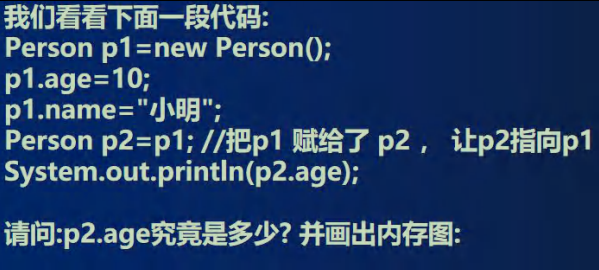
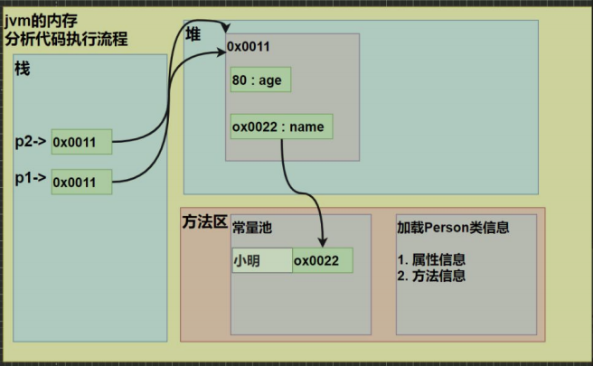
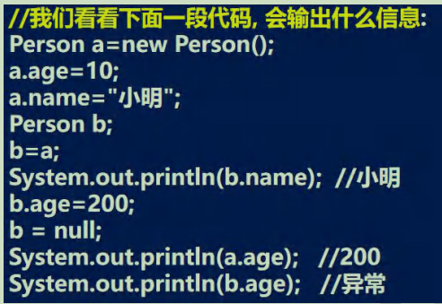
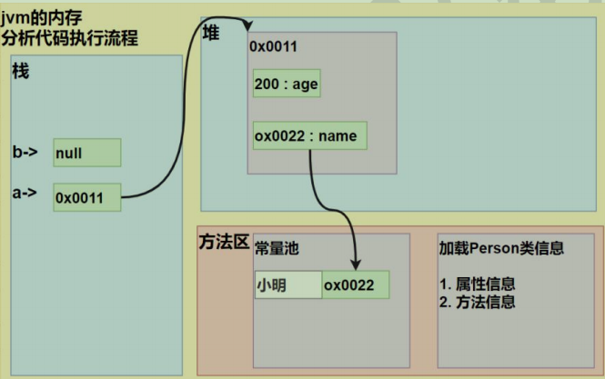
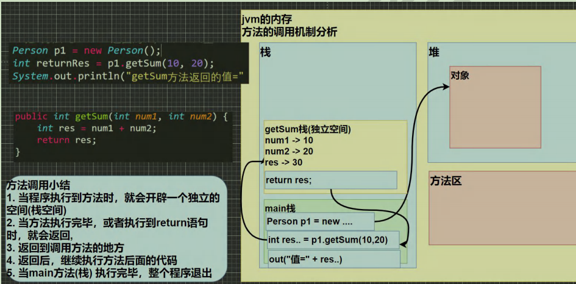
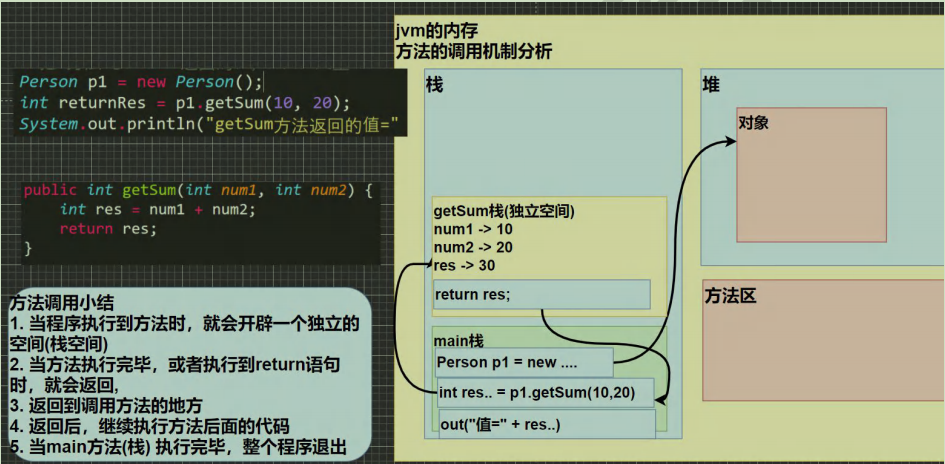
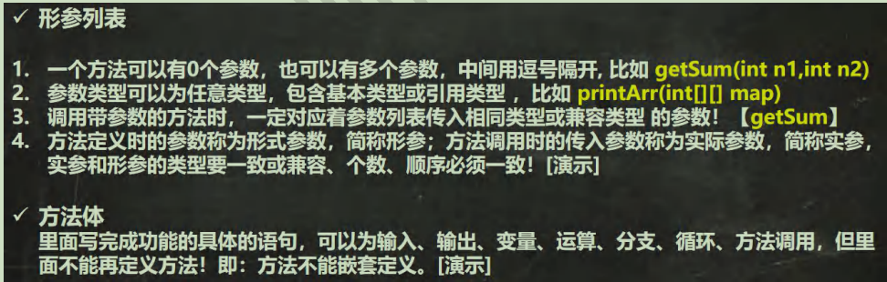
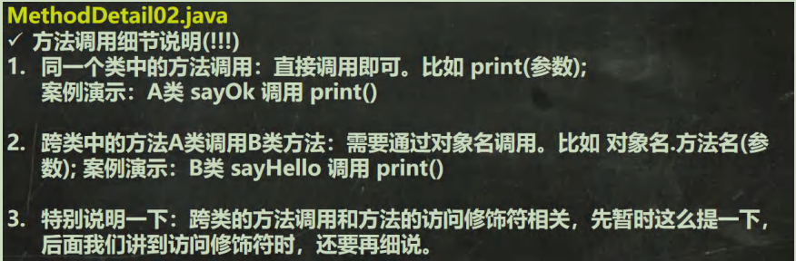

# 面向对象

## 属性注意事项和细节说明

1. 属性的定义语法同变量，示例：访问修饰符 属性类型 属性名;
    简单的介绍访问修饰符： 控制属性的访问范围
        有四种访问修饰符 public, proctected, 默认, private ,后面我会详细介绍
2. 属性的定义类型可以为任意类型，包含基本类型或引用类型
3. 属性如果不赋值，有默认值，规则和数组一致。
    具体说: int 0，short 0, byte 0, long 0, float 0.0,double 0.0，char \u0000，boolean false，String null

## 创建对象

1. 先声明再创建
    Cat cat ; //声明对象 cat
    cat = new Cat(); //创建
2. 直接创建
    Cat cat = new Cat();

## 访问属性

对象名.属性名;

## 类和对象的内存分配机制

### Java 内存的结构分析

1. 栈： 一般存放基本数据类型(局部变量)
2. 堆： 存放对象(Cat cat , 数组等)
3. 方法区：常量池(常量，比如字符串)， 类加载信息
4. 示意图 [Cat (name, age, price)]

### Java 创建对象的流程简单分析

    Person p = new Person();
    p.name = “jack”;
    p.age = 10;

1. 先加载 Person 类信息(属性和方法信息, 只会加载一次)
2. 在堆中分配空间, 进行默认初始化(看规则)
3. 把地址赋给 p , p 就指向对象
4. 进行指定初始化， 比如 p.name =”jack” p.age = 10

## 方法使用

1. 方法写好后，如果不去调用(使用)，不会输出
2. 先创建对象 ,然后调用方法即可

## 成员方法的好处

1. 提高代码的复用性
2. 可以将实现的细节封装起来，然后供其他用户来调用即可

## 成员方法的定义

访问修饰符 返回数据类型 方法名（形参列表..） {//方法体
    语句；
    return 返回值;
}

1. 形参列表：表示成员方法输入 cal(int n) ， getSum(int num1, int num2)
2. 返回数据类型：表示成员方法输出, void 表示没有返回值
3. 方法主体：表示为了实现某一功能代码块
4. return 语句不是必须的。
5. 老韩提示: 结合前面的题示意图, 来理解

## 成员方法注意事项和使用细节

1.访问修饰符 (作用是控制 方法使用的范围)
    如果不写默认访问，[有四种: public, protected, 默认, private], 具体在后面说
2.返回数据类型
    一个方法最多有一个返回值 [思考，如何返回多个结果 返回数组 ]
    返回类型可以为任意类型，包含基本类型或引用类型(数组，对象)
    如果方法要求有返回数据类型，则方法体中最后的执行语句必须为 return 值; 而且要求返回值类型必须和 return 的值类型一致或兼容
    如果方法是 void，则方法体中可以没有 return 语句，或者 只写 return ;
3.方法名
    遵循驼峰命名法，最好见名知义，表达出该功能的意思即可, 比如 得到两个数的和 getSum, 开发中按照规范

